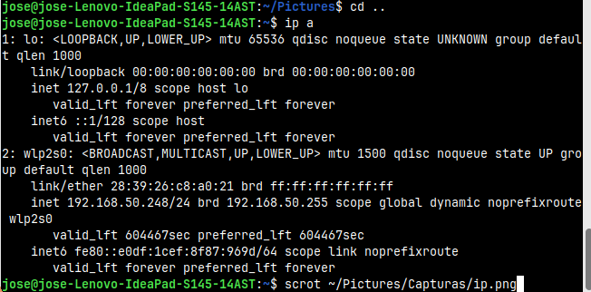
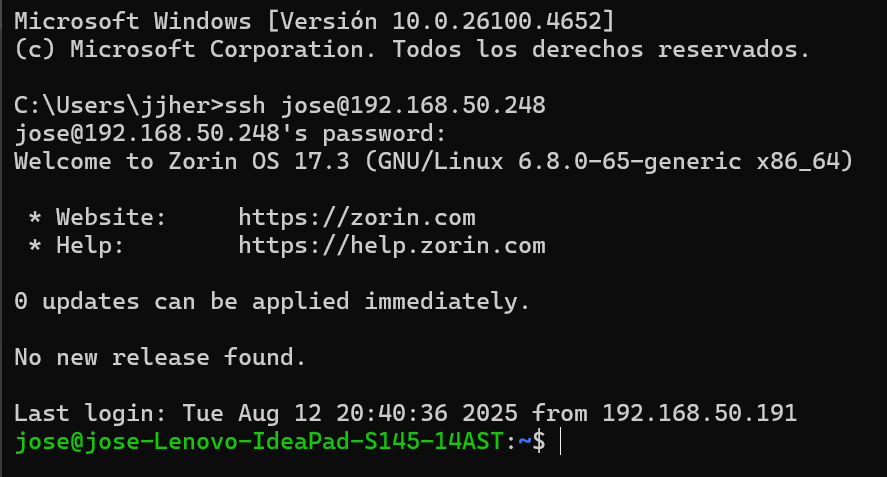
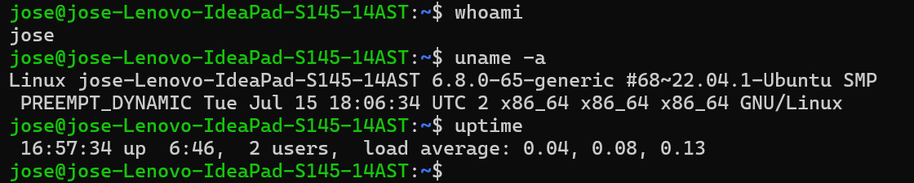

**Read this in other languages:**
- [Español](#instalación-y-prueba-de-servidor-ssh-en-zorin-os-español)
- [English](#installation-and-testing-of-ssh-server-on-zorin-os-english)


---


# Instalación y Prueba de Servidor SSH en Zorin OS (Español)

## 1. Instalación de OpenSSH Server

En el servidor (Lenovo S145 con Zorin OS 17), se instaló el servicio openssh-server para permitir conexiones remotas seguras.

### Paso 1: Actualizar el sistema

Antes de instalar, es recomendable actualizar los paquetes para asegurarnos de contar con las últimas versiones:

```bash
sudo apt update && sudo apt upgrade -y
```
Esto ayuda a mantener el sistema optimizado y libre de problemas de compatibilidad.

### Paso 2: Instalar OpenSSH Server

Ejecutamos el siguiente comando para instalar el servicio: 

```bash
sudo apt install openssh-server
```

### Paso 3: Verificar el estado del servicio

Una vez finalizada la instalación, podemos comprobar si el servicio se instaló correctamente y está activo:

```bash
sudo systemctl status ssh
```
Si aparece como **active (running)**, el servidor SSH está funcionando correctamente.

## 2. Prueba de conexión desde el cliente (Pc con windows 11)

Para verificar que el servidor SSH está funcionando, realizamos una conexión desde el cliente (PC con Windowns 11 en este caso) usando PowerShell

### Paso 1: Obtener dirección IP del servidor (Zorin OS)

Ejecutamos el siguiente comando en la terminal del servidor:

```bash
ip a
```



La dirección IP local del servidor obtenida nos ayudará a conectarnos desde el cliente

### Paso 2: Conectar con el Servidor

Desde el cliente (PC con Windows 11), abrimos PowerShell y ejecutamos el siguiente comando, reemplazando 'usuario' e 'IP' por los valores correspondientes

**Nota: usuario e IP son válores del servidor**

```bash
ssh usuario@ip-del-servidor
```
Si es la primera vez que nos conectamos, aparecerá un mensaje solicitando confirmar la huella digital del servidor. Escribimos yes y presionamos Enter para continuar

### Paso 3: Ingresar la contraseña

Cada vez que sea solicitada, introducimos la contraseña del usuario del servidor



### Paso 4: Probar comandos básicos

Ejecuta los siguientes comandos básicos:

```bash
whoami
uname -a
uptime
```

- **whoami**: Muestra el nombre del usuario con el que se está trabajando. Muy util para verificar roles y permisos

- **uname -a**: Muestra información completa del sistema operativo, incluye el kernel, versión, arquitectura y hostname

- **uptime**: Muestra cuánto tiempo lleva encendido el servidor, cuántos usuarios están conectados y el promediode carga del sistema




# Installation and Testing of SSH Server on Zorin OS (English)

## 1. Installing OpenSSH Server

### Step 1:  Update the Operating System

Before installing, it is advisable to update the packages to ensure we have the latest versions:

```bash
sudo apt update && sudo apt upgrade -y
```
This helps keep the system optimized and free of compatibility issues.

### Step 2: Install OpenSSH Server

Run the following command to install the service:

```bash
sudo apt install openssh-server
```

### Step 3: Verify the Service Status

Once the installation is completed, check if the service was installed correctly and is active: 

```bash
sudo systemctl status ssh
```

If it shows **active (running)**, the SSH server is running correctly.

## 2. Connection Test from the Client (PC with Windows 11)

To Verify the SSH server is working, we realize a conection from the client (PC with windows 11 in this case) using PowerShell.

### Step 1: Get IP address from the server

Run the following command from the server terminal:

```bash
ip a
```


The local IP address got from the server will helps us to connect from the client.

### Step 2: Connect with the server from client

From the client (PC with Windows 11) open PowerShell and run the following command, replacing 'user' and 'server-ip-address' for the corresponding values:

**Note: 'user' and 'ip' are server values**

```bash
ssh user@server-ip-addrress
```

If this is your first time connecting, a message will appear asking you to confirm the server fingerprint. Type yes and press Enter to continue.

### Step 3: Type the password

Each time the system asks for the password, enter the server user's password.


### Step 4: Test basic commands

Run the following commands:

```bash
whoami
uname -a
uptime
```

- **whoami**: Shows the username whom is working, useful for verifying roles and permissions.

- **uname -a**: Shows operating system information, includes kernel, version,
architecture and hostname

- **uptime**: Shows how long is the server had been working, how many users are connected and the average system load

