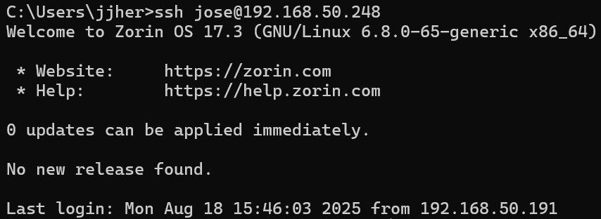
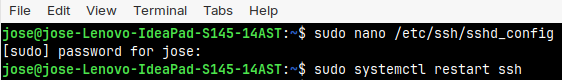

**Read this in other languages**

- [Español](#configuración-de-ssh)
- [English](#ssh-configuration)


# Configuración de SSH

## 1. Autenticación por claves SSH

En la Semana 1, cuando tratamos de conectarnos al servidor, utilizamos la contraseña del usuario registrado en el mismo, lo cual no es una práctica recomendable por varios motivos. Sin embargo, el que más nos llama la atención es que las contraseñas suelen ser débiles, se pueden adivinar, filtrar o romper con fuerza bruta.

El protocolo **Secure Shell (SSH)**, nos brinda una herramienta que nos ayuda a mejorar la seguridad de la conexión al servidor, permitiendo el uso de claves en lugar de contraseñas.

Las claves SSH son criptográficas y  mucho más complejas que cualquier contraseña común. Tanto es así que romper una clave **ed25519** de 256 bits es prácticamente imposible con la tecnología actual.

Una clave **ed25519** es un tipo de clave criptográfica utilizada en SSH basada en curvas elípticas. Permite autenticarse de forma segura sin usar contraseñas, ofreciendo alta seguridad con claves más cortas, rapidez en la verificación y resistencia a ataques como la fuerza bruta. Se compone de una clave privada (que se guarda en el PC y no se comparte) y una pública (que se sube al servidor) para validar la identidad.

Para configurar las claves ssh ejecutamos los siguientes pasos:

### Paso 1: Generar claves SSH en el cliente

Desde PowerShell ejecuta:

```bash
ssh-keygen -t ed25519 -C "usuario@email.com"
```

Este comando genera un par de claves SSH, una privada y una pública, incluimos el correo electrónico con la finalidad de identificar de quien es la clave, por si se tienen varias.

### Paso 2: Copiar la clave pública al servidor


Ejecutamos dir 
```bash
C:\Users\nombre-de-usuario\.ssh
```
Esto mostrará los archivos de la carpeta '.ssh'. Verifica que exista el archivo 'id_ed25519'.pub, que corresponde a la clave pública.

Luego, para visualizar el contenido de la clave pública:

```bash
type C:\Users\nombre-usuario\.ssh\id_ed25519.pub
```
Copia el resultado.

Después, desde PowerShell ingresa al servidor como normalmente lo hacías con contraseña y crea el directorio .ssh si no existe y el archivo **authorized_keys**:

```bash
mkdir -p ~/.ssh
chmod 700 ~/.ssh
```

Creación de archivo:

```bash
nano ~/.ssh/authorized_keys
```

Pega dentro de este archivo el contenido de la clave pública copiada desde Windows.

Por último, ajusta los permisos y sal del servidor:

```bash
chmod 600 ~/.ssh/authorized_keys
exit
```

### Paso 3: Probar conexión sin contraseña

Como ya compartimos con el servidor la clave pública generada en el cliente, al intentar conectarnos el servidor verificará automáticamente si la clave privada coincide con la clave pública guardada en `authorized_keys`.  

Si coinciden, la conexión será autorizada sin necesidad de ingresar contraseña.  

Para probarlo, ejecuta:

```bash
ssh usuario@ip-del-servidor
```



## 2. Endurecer la seguridad en sshd_config

Como buena práctica de seguridad, debemos editar la configuración de SSH para aceptar solo la autenticación por claves y evitar accesos inseguros.

Edita el archivo de configuración:

```bash
sudo nano /etc/ssh/sshd_config
```

Asegúrate de que las siguientes líneas estén configuradas de esta forma:

```bash

PubkeyAuthentication yes
PasswordAuthentication no
PermitRootLogin no
```
**Nota**: Con estas opciones, solo será posible acceder con claves SSH y no con contraseñas. Además, se bloquea el acceso directo como root.

Luego reinicia el servicio para aplicar cambios:

```bash
sudo systemctl restart ssh
```



Con estos pasos habrás configurado la autenticación por claves ssh de forma segura y aplicando buenas practicas que refuerzan la seguridad del servidor.

## Conclusión

Al cambiar el inicio de sesión con contraseñas por autenticación con claves SSH, has mejorado significativamente la seguridad de tu servidor. Esta configuración no solo protege contra ataques de fuerza bruta, sino que también hace las conexiones más rápidas y confiables.  

Para reforzar aún más la seguridad, puedes combinar esta configuración con otras buenas prácticas como el uso de un firewall, mantener el sistema actualizado y restringir el acceso SSH a direcciones IP específicas.

# SSH Configuration

## 1. SSH key-Based Authentication

At firts, we connected to the server using the user's password. This is not a recommended practice for several reasons. The main one is that password are often weak: they can be guessed, leaked, or brute-forced.

The **Secure Shell (SSH)** protocol provides a more secure alternative by allowing authentication with keys instead of passwords.

SSH keys are cryptographic and much more complex tan any regular password. Breaking a **256-bit ed25519** key with current technology is practically impossible.

An **ed25519** key is a type of cryptographic key based on alliptic curve algorithms. It allows secure authentication without passwords, offering high security with shorter keys, fast verification, and strong resistance against brute-force attacks. It consists of a private key (stored safely on your PC and never shared) and a public key uploaded to the server to validate you identity.

To configurate SSH keys, follow these steps:

### Step 1: Generate SSH keys on the client

From PowerShell, run:

```bash
ssh-keygen -t ed25519 -C "user@email.com"
```

This command generates a pair of SSh keys: one private and one public. The email is included as a label to help  identify the key in case you manage multiple keys.

### Step 2: Copy the public key to the server

List the .shh directory in Windows:

```bash
C:\Users\your-username\.ssh
```

You showld see a file named **id_ed25519.pub**, which is the public key.

To view its contents, run:

```bash
type C:\Users\your-username\.ssh\id_ed25519.pub
```

Copy the output.

Next, log in to the server (with the user password) and create the .ssh directory if it does not exits. The create the authorized_keys file:

```bash
mkdir -p ~/.ssh
chmod 700 ~/.ssh
nano ~/.ssh/authorized_keys
```

Paste the public key into this file.

Finally, set the correct permissions and exit the server

```bash
chmod 600 ~/.ssh/authorized_keys
exit
```

### Step 3: The Passwordless connection

Now that the public key is stored on the server, when you connect, SSH will check if your private key matches the public key in authorized_keys.

If they match, the connection will be established without asking for a password. Test it with

```bash
ssh usuario@ip-del-servidor
```


## 2. Harden Security in sshd_config

As a best practice, update the the SSH configuration to accept only key-based authentication and block insecure access.

Edit the configuration file:

```bash
sudo nano /etc/ssh/sshd_config
```

Make sure the following lines are set:

PubkeyAuthentication yes
PasswordAuthentication no
PermitRootLogin no

**Note**: with these settings, only SSH keys are allowed (password login is disabled), and direct root login is blocked.

Restart the service to apply changes:

```bash
sudo systemctl restart ssh
```


With these steps, you have configurated SSH key-based authentication and applied best practice to harden the server's security.

## Conclusion

By switching from password-based logins to SSH key authentication, you have significantly improved the security of your server. This setup not only protects against brute-force attacks but also ensures faster and more reliable connections.

For even stronger security, you can combine this setup with other best practices such as using a firewall, keeping your system updated, and restricting SSH access to specific IPs addresses.