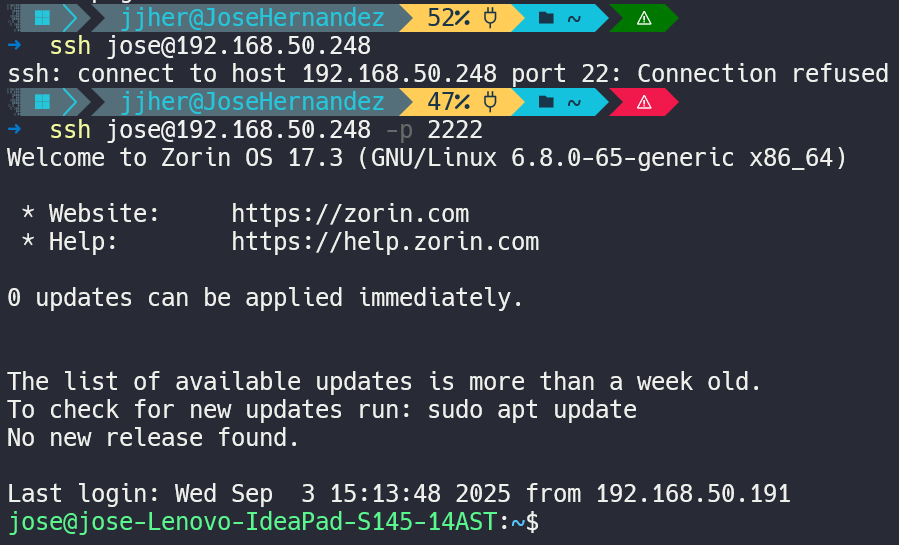

**Read this in other languages**
-[Español](#cambio-de-puerto-y-administración-de-usuarios)
-[English]

# Cambio de Puerto y Administración de usuarios

## Cambio de puerto

El servicio SSH se comunica a través del puerto 22 por defecto, lo que lo convierte en un objetivo común para atacantes de todo el mundo que tienen esa información clara. La mayoría de los ataques automatizados de fuerza bruta se dirigen directamente a este puerto.

Por esta razón, una práctica recomendada es cambiar el puerto 22, no como una medida de seguridad absoluta, sino como una forma de reducir la exposición y mantener un nivel adicional de discreción.

### Paso 1: Editar configuración en el server

Ejecutamos el siguiente comando para editar el archivo de configuración de SSH:
```bash
sudo nano /etc/ssh/sshd_config
```

Luego, localizamos la línea que indica el número de puerto que utiliza para la comunicación, por defecto está indicada como: **#Port 22** y la modificamos a un número de puerto entre 1024 a 65535, ya que los menores a 1024 suelen estar reservados.

Ejemplo de cambio:
```bash
#Port 2288
```

Luego reiniciamos el servicio para efectuar los cambios hechos en el archivo de configuración:

```bash
sudo systemctl restart ssh
```

### Paso 2: Probar conexión desde el cliente

Antes, la conexión se establecía de esta forma:
```bash
ssh user@ip_server
```
Si el usuario tenía configurada autenticación por claves SSH, el acceso era automático.

Ahora, como cambiamos el puerto, debemos especificarlo al conectarnos. Esta es la principal “desventaja”: recordar y escribir el puerto cada vez. Sin embargo, sigue siendo una buena práctica de seguridad, ya que disminuye la cantidad de intentos automáticos de acceso.

Ejemplo de conexión usando el nuevo puerto:
```bash
ssh jose@192.168.51.243 -p 2288
```

La autenticación sigue funcionando de la misma manera (si tenemos la clave configurada), pero ahora el servicio escucha en un puerto diferente.
<div align='center'>

</div>

## Administración de Usuario
*(Próximamente)*